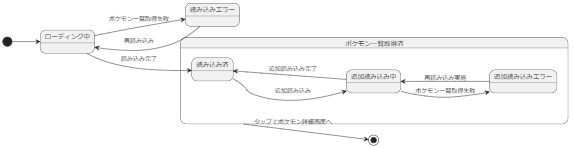
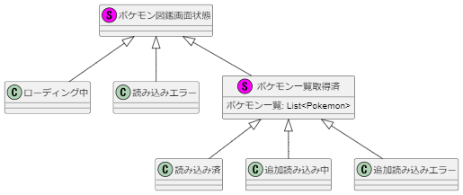

# ポケモン図鑑画面 設計

ポケモン図鑑画面の設計について記載

- [ポケモン図鑑画面 設計](#ポケモン図鑑画面-設計)
  - [外部仕様](#外部仕様)
  - [状態遷移](#状態遷移)
    - [状態クラス](#状態クラス)

## 外部仕様

- 画面を表示するとスピナー表示してポケモン一覧を取得
  - 読み込み失敗したときはボタン押下で再読み込みできるようにする

- 取得したポケモンを随時リストで表示

- ポケモンをタップすると詳細情報を表示する画面へ遷移

- リストをスクロールすると追加で読み込む
  - 追加読み込みに失敗するとボタン押下で再読み込みできるようにする

## 状態遷移

- 外部仕様から作成した状態遷移図

### 状態クラス
- 上記の状態遷移図を基に状態クラスを設計
  - 状態管理クラスでポケモン図鑑画面状態クラスを用いて状態管理をする

