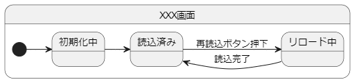

# flutterアプリ 基本設計

Flutterアプリの基本設計を簡単に示す

- [flutterアプリ 基本設計](#flutterアプリ-基本設計)
  - [設計思想](#設計思想)
    - [有限オートマトン・ステートマシン](#有限オートマトンステートマシン)
    - [クラス図](#クラス図)
  - [参考情報](#参考情報)

## 設計思想

### 有限オートマトン・ステートマシン
- 有限個の状態と動作を数学的に抽象化された数学的なモデル

### クラス図
- 記載中

## 参考情報

- [[FlutterKaigi2024]ステートマシンで実現する高品質なFlutterアプリ開発](https://speakerdeck.com/teamlab/flutterkaigi2024-sutetomasindeshi-xian-surugao-pin-zhi-naflutterapurikai-fa)