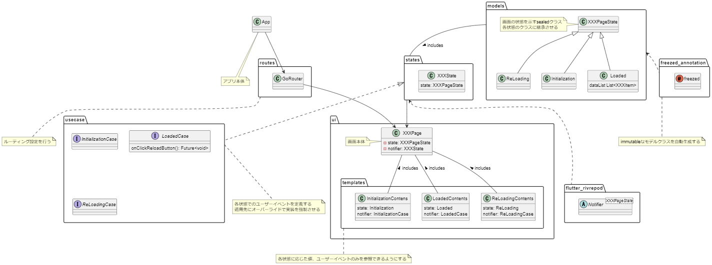
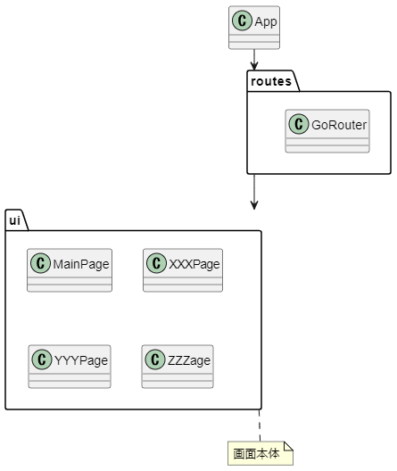
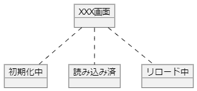
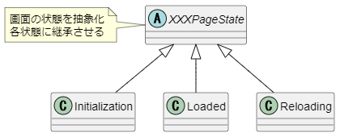
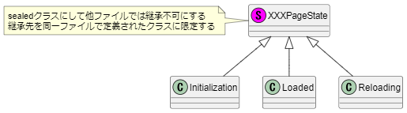

# flutterアプリ 基本設計

Flutterアプリの基本設計を簡単に示す

- [flutterアプリ 基本設計](#flutterアプリ-基本設計)
  - [設計思想](#設計思想)
    - [有限オートマトン・ステートマシン](#有限オートマトンステートマシン)
    - [クラス図](#クラス図)
      - [ルーティング設定](#ルーティング設定)
      - [状態管理](#状態管理)
        - [モデルの作成](#モデルの作成)
        - [状態管理クラス](#状態管理クラス)
  - [参考情報](#参考情報)

## 設計思想

- ベースはMVVM

### 有限オートマトン・ステートマシン
- 有限個の状態と動作を数学的に抽象化されたモデル

- 例えば以下のような振る舞いをする画面について考える
  - 初期化中: 画面表示時にデータの読み込みを行う
  - 読み込み済: 読み込んだデータを画面に表示する
  - リロード中: データを再読み込みを行う
  - ※エラーケースを考慮すると面倒なので省略

### クラス図

- 全体像は以下ようになる

#### ルーティング設定
- 各画面のウィジェットは`GoRouter`に設定されることで画面遷移を定義する
- これらの設定をアプリ本体のウィジェットに適用するこで画面が表示される

#### 状態管理

##### モデルの作成

- [有限オートマトン・ステートマシン](#有限オートマトンステートマシン)の状態遷移図を落とし込むと以下の図となる
  - 便宜上オブジェクト図を使用

- 上記の図で各状態を木構造で示すことができた
  - 木構造にできるということはオブジェクト指向の継承に落とし込むことができる

- 抽象クラスではなくsealedクラスにして継承させる
  - sealedクラスでは他ファイルで定義されたクラスに継承ができない
  - 意図しない状態に継承して増やさないために有用
  - 限られた型のみを扱うのでswitch式と相性が良く抜け漏れを防げる
    - [switch文からswitch式へ: Dart3の新機能"switch式"解説](https://qiita.com/TakehiroKATO/items/f8ac420b439851f0c219)

##### 状態管理クラス

- 記載中

## 参考情報

- [[FlutterKaigi2024]ステートマシンで実現する高品質なFlutterアプリ開発](https://speakerdeck.com/teamlab/flutterkaigi2024-sutetomasindeshi-xian-surugao-pin-zhi-naflutterapurikai-fa)